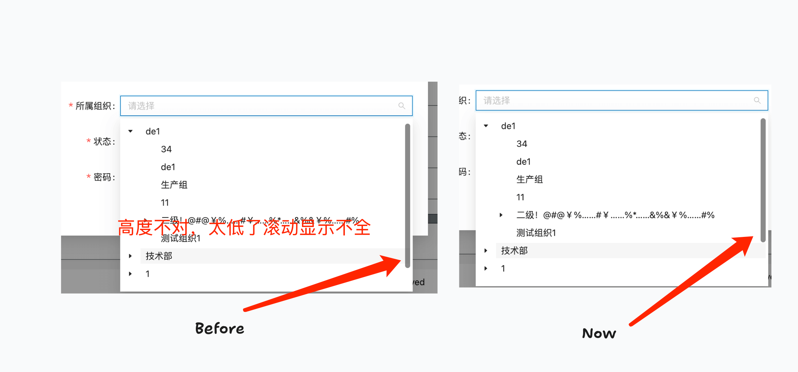

# report-antd-tree-select

Related issue: https://github.com/ant-design/ant-design/issues/51547

项目遇到 antd 展开下级时，虚拟滚动高度计算有问题，导致展开时，滚动条无法滚动到底部，无法查看全部数据。查询 antd 的版本，当前版本是没有这个问题的。

以下做法可以解决问题：

1. 删除 node_modules 文件夹，使用 npm 安装项目依赖，使用 npm run dev 启动项目。虚拟滚动恢复正常。
2. 删除 node_modules 文件夹和 `pnpm-lock.yaml` 文件，使用 pnpm@9.15（当前最新版） 安装项目依赖，虚拟滚动恢复正常。

猜测可能是 `pnpm-lock.yaml` 锁定了有问题的版本，查询 `pnpm-lock.yaml` 文件并未发现有问题的版本。猜测 pnpm 在 node_modules 文件夹中存在有问题的版本。

---

The project encountered a problem with the virtual scroll height calculation when expanding the lower level of antd, which caused the scrollbar to be unable to scroll to the bottom when expanded, making it impossible to view all data. After checking the version of antd, it was found that the current version does not have this problem.

The following methods can solve the problem:

1. Delete the node_modules folder, use npm to install project dependencies, and use npm run dev to start the project. Virtual scrolling returns to normal.
2. Delete the node_modules folder and the pnpm-lock.yaml file, use pnpm@9.15 (the latest version) to install project dependencies, and virtual scrolling returns to normal.

It is speculated that the pnpm-lock.yaml file may have locked a problematic version. After checking the pnpm-lock.yaml file, no problematic version was found. It is speculated that there may be a problematic version in the node_modules folder.

